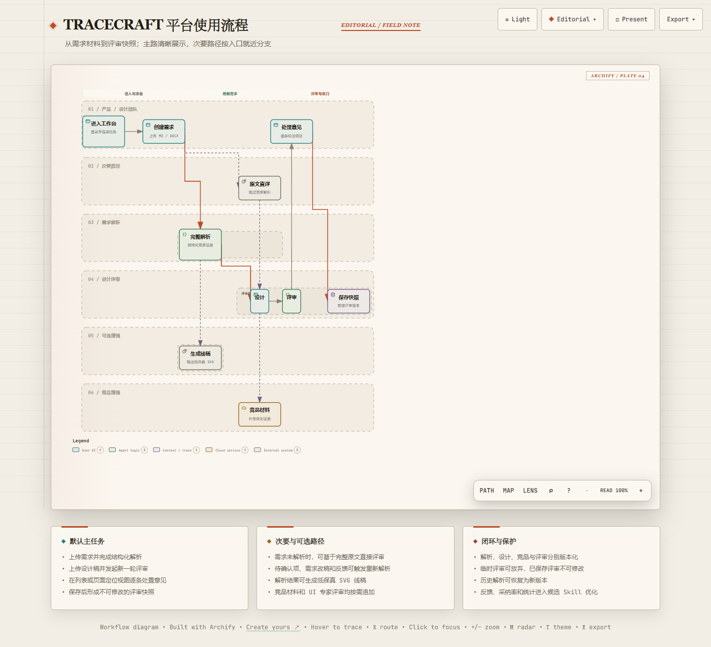
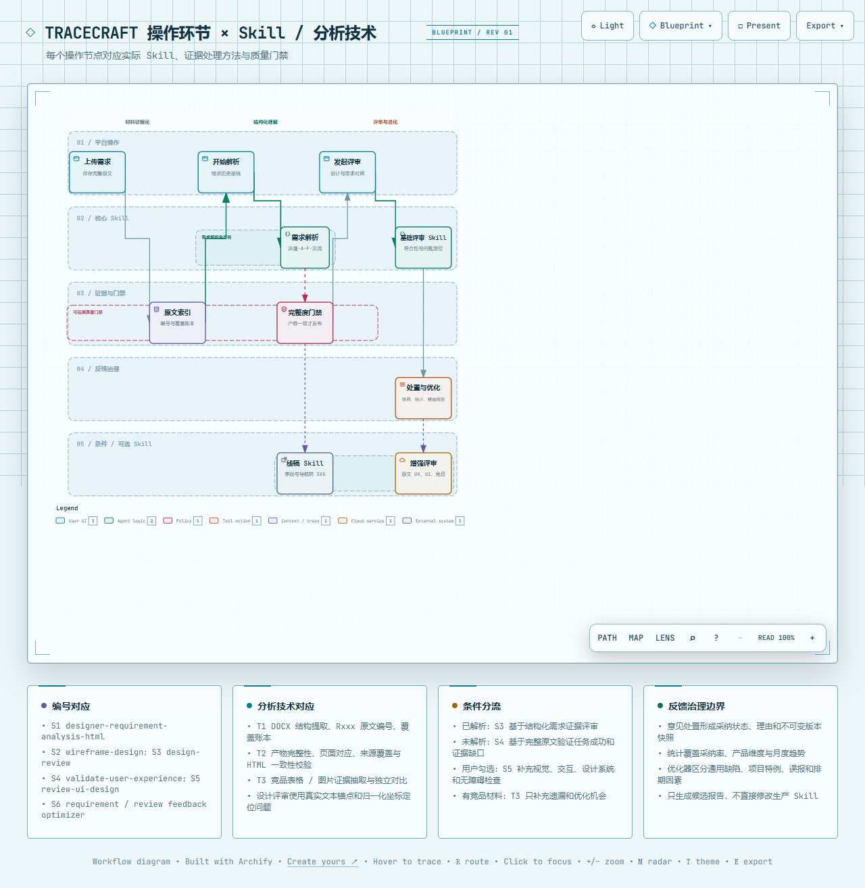
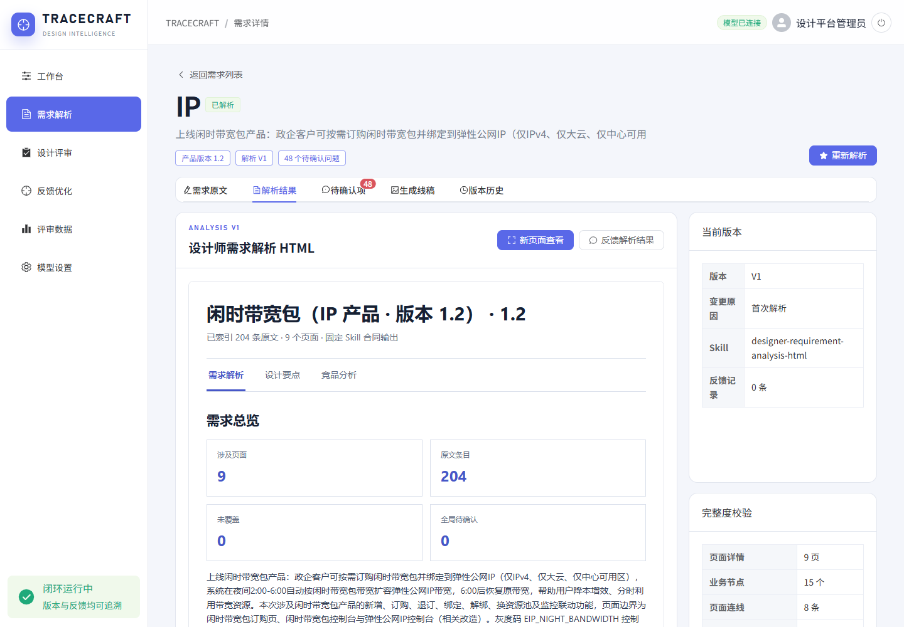
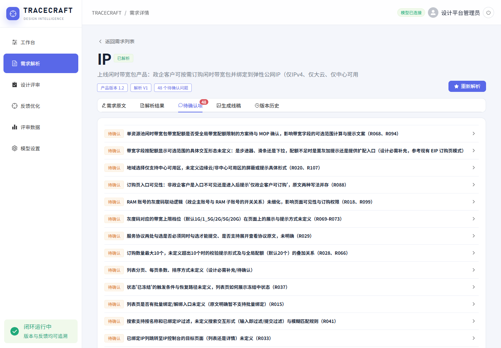
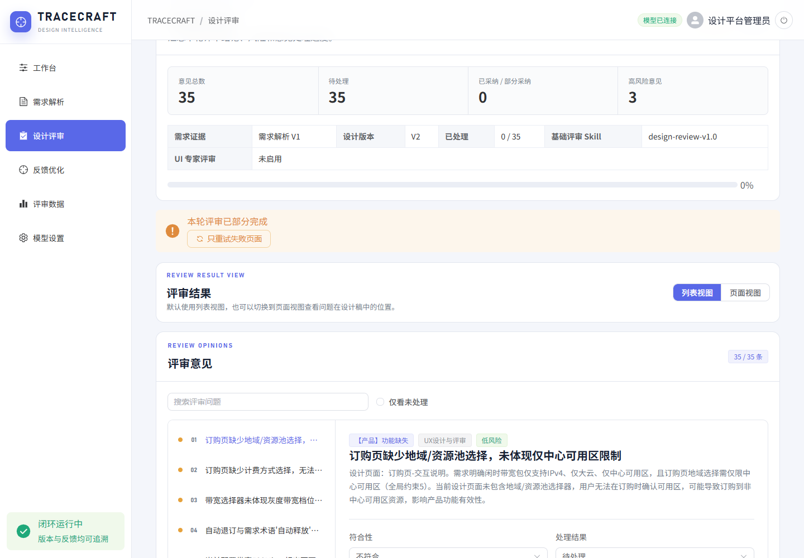
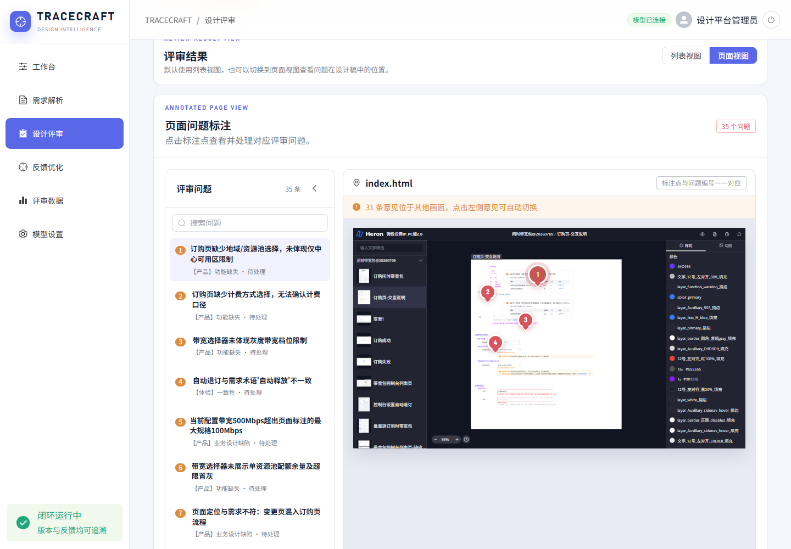
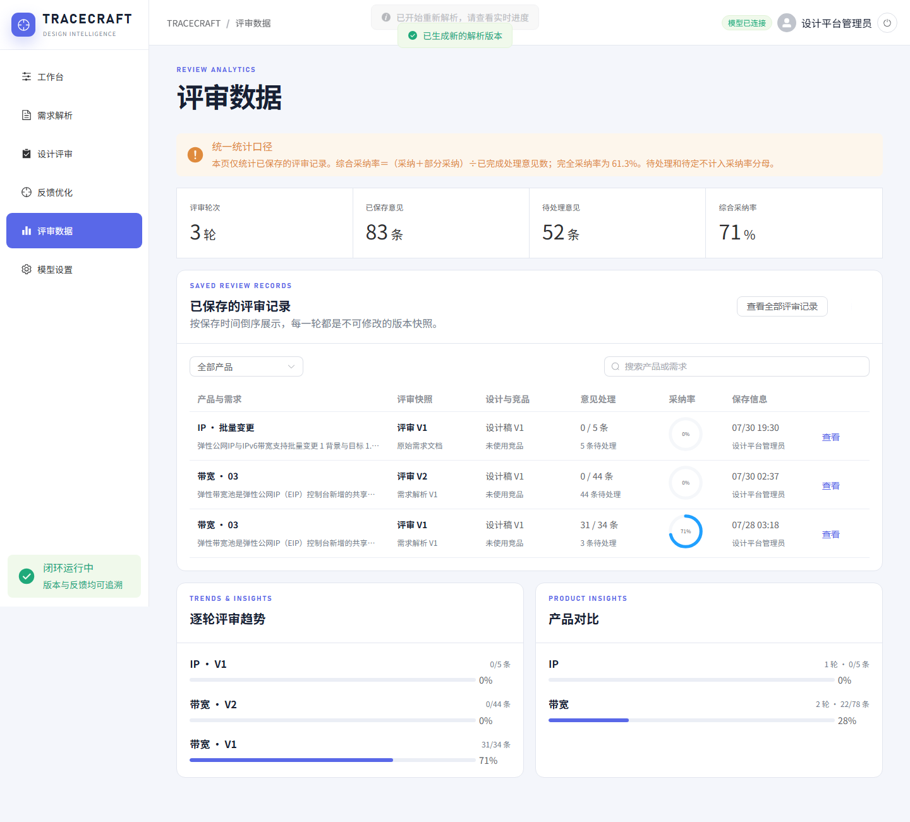
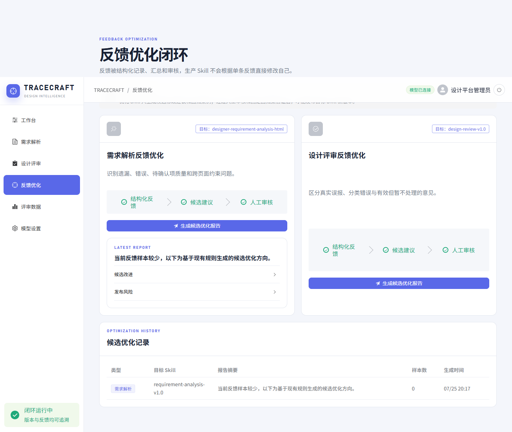

# 从需求文本到设计证据链

## TRACECRAFT 需求解析与设计评审平台的体验创新实践

申报单位：[待补充：申报单位]

作者/团队：[待补充：作者姓名及团队]

项目周期：[待补充：正式立项与实施周期]

案例类别：[待补充：参评组别]

> 数据说明：本文基于项目源码、界面、数据库、运行产物、反馈记录和自动化校验结果撰写。文中“11 条需求、12 个解析版本、11 轮评审”等数字，均指 2026 年 7 月 27 日至 8 月 5 日之间保存在本地项目中的可核验记录，不等同于正式生产环境规模或组织级业务成效。

## 摘要

复杂数字产品的设计质量，往往并非败在设计师缺少方法，而是败在证据断裂：原始需求散落在 Word、Markdown 和评审沟通中，设计师需要手工把业务规则翻译成页面、流程、字段、状态和异常；设计稿完成后，评审意见又常以聊天消息、截图或口头结论存在，难以回答“这条意见来自哪一条需求”“针对哪个设计版本”“后来是否被采纳”“同类问题能否沉淀为组织能力”。TRACECRAFT（知构）以“让需求、设计与评审在一条证据链上协作”为核心命题，构建了从需求材料、结构化解析、待确认项、设计稿版本、设计评审、意见处置、不可变快照，到反馈驱动 Skill 候选优化的本地全栈平台。

平台并不把生成式模型当作一次性答案机，而是把 AI 嵌入一套可检查、可恢复、可追溯的人机协同流程：需求解析生成 Rxxx 原文编号、业务泳道、A-F 业务链路、页面流程、逐页面详情、设计风险和竞品证据；解析结果必须通过原文覆盖、页面对应、流程完整和产物一致性校验；评审阶段从 Pixso、Sketch MeaXure 或普通 HTML 中提取页面证据，输出带来源、风险、影响、建议、验证方法和页面定位的结构化意见；人工对意见进行采纳、部分采纳、不采纳或待定处置，保存后形成不可修改的版本快照；反馈优化只生成候选建议和回归案例，不直接改写生产 Skill。

当前项目已达到“可运行并留有真实记录的本地 MVP”成熟度。项目数据库包含 11 条需求、12 个解析版本、9 个设计稿版本、11 轮评审和 213 条评审意见；其中 3 轮已保存评审包含 83 条意见，31 条已形成明确处置，当前样本口径下综合采纳率为 71.0%、完全采纳率为 61.3%。这些数字说明闭环能够被实际使用和统计，但由于样本集中、待处理意见较多、尚无正式部署与用户研究证据，本文将其视为“机制有效性证据”，而非效率、满意度或商业价值结论。项目的核心价值在于：把模糊的 AI 输出转化为受约束的设计基础设施，使人始终保有决策权，使每一次设计判断都有来源、版本和后续去向。

**关键词：** 需求解析；设计评审；用户体验；证据链；生成式人工智能；人机协同；版本治理

## 一、项目背景：设计协作的真正成本来自“翻译”和“失忆”

在云产品、企业服务和复杂后台系统中，一份需求文档常同时包含业务目标、账号权限、资源限制、计费规则、状态机、异常分支、接口依赖和验收条件。设计师接手后，第一项工作并不是画页面，而是完成一轮高强度的“业务到界面”翻译：哪些内容对应一级页面，哪些应进入弹窗或抽屉，字段的默认值和校验是什么，失败后如何恢复，跨页面术语是否一致，哪些规则尚未确认。传统协作方式通常依赖个人经验、手工摘录和会议对齐，结果容易出现三个问题。

第一，原文与设计之间缺少稳定映射。页面上一个置灰按钮、一条提示文案或一个字段限制，往往无法快速追溯到需求条款；当需求改版时，团队也难以判断哪些页面和评审结论需要同步更新。第二，评审过程缺少版本语义。设计稿更新、需求补充和评审意见处置可能同时发生，如果缺少版本快照，“当时评的是哪一版”会逐渐变得不可回答。第三，反馈无法形成组织学习。设计师对 AI 评审意见的接受、质疑和拒绝本身是高价值数据，但如果理由没有被结构化记录，就无法区分通用规则缺陷、项目特例、证据不足和模型误报。

TRACECRAFT 因此没有从“做一个更聪明的评审机器人”出发，而是把问题重新定义为：如何建立一条覆盖材料、理解、设计、评审、处置和优化的证据链，让 AI 的速度与人的判断可以同时存在，让每一步都能被解释、被复核、被恢复。[E01][E02]

图1 TRACECRAFT 平台主流程｜来源：项目运行界面与源码流程，作者整理｜该图说明：平台以需求为起点，把解析、设计、评审、处置和快照串联为可追溯主链路，并保留原文直评、线稿与竞品等可选分支。

## 二、研究对象与证据方法

### 2.1 用户与核心任务

从产品信息架构、角色权限和真实使用记录可以识别出四类核心角色。产品经理负责上传和维护需求原文、回答待确认问题；设计师消费结构化解析结果、上传设计稿并处理评审意见；设计评审者关注证据、风险、影响与验证方式，决定意见是否成立；平台管理员维护模型设置、查看全部评审记录，并发起候选 Skill 优化。研发和测试并非平台的主要操作角色，但可把已确认的页面、状态、异常和评审结论作为后续实现与验收输入。[E03][E04]

这些角色共同完成的不是单一“生成”任务，而是一条连续任务链：理解需求、发现冲突、形成设计依据、核对设计、处置意见、固定版本、积累反馈。平台的体验设计必须同时满足可发现性、可理解性、可操作性、可预期性、可恢复性和可追溯性，任何一步只要成为黑箱，后续链路都会失去可信基础。

### 2.2 证据化分析方法

本文没有把界面截图当作唯一证据，而是采用六类材料交叉核验：一是 README、类型定义和前后端接口，确认产品范围与数据结构；二是 11 条需求及其 12 个解析版本，确认功能被实际调用；三是 analysis-runs 中的原文索引、分析数据、页面流程、覆盖账本、HTML 和运行清单，确认解析不是静态演示；四是设计稿包和 11 轮评审记录，确认评审链路与页面定位；五是 JSONL 反馈和候选优化记录，确认闭环数据确实落盘；六是浏览器走查、类型检查、生产构建及自带 smoke tests，确认关键路径可运行。[E05]-[E12]

项目仓库未保留正式访谈纪要、可用性测试报告、工时对照或满意度调查，因此本文不虚构用户研究结论，也不主张“效率提升百分比”。本案例把可验证重点放在机制层：证据是否完整、任务能否闭环、失败是否可恢复、统计口径是否明确、AI 是否受到边界控制。

## 三、体验策略：把 AI 输出设计成“可治理的工作对象”

### 3.1 一条证据链，而不是多个孤立工具

平台的核心对象并不是提示词，而是版本化证据。需求上传后保留原始文件与可编辑文本；解析版本关联原文、Skill、运行方式、校验结果和产物路径；设计版本关联文件及顺序；评审版本同时锁定需求证据模式、解析版本、设计版本、竞品版本、模型、Skill 和意见；意见自身又包含问题类型、严重度、符合性、证据来源、用户影响、解决建议、验证方式、处置状态和页面标注。由此，团队能够从一条评审意见向前追溯到设计页面和需求来源，向后追踪到处置理由、保存快照与反馈样本。[E13]

图2 平台操作环节与 Skill、证据技术的对应关系｜来源：项目 Skill 配置、运行流程与源码，作者整理｜该图说明：需求解析、质量门禁、设计评审和反馈治理相互隔离，并可分别校验与演进。

### 3.2 人始终处在决策回路中

平台没有要求 AI 自动消除所有不确定性，而是把不确定性显性化。解析产生的待确认项可以被回答、忽略或恢复；重新解析会创建新版本，而不是覆盖历史；评审意见默认处于“待处理”，由人选择采纳、部分采纳、不采纳或待定；部分采纳和不采纳必须填写理由；已保存评审不可修改，临时评审可以放弃。这样设计的目的，是把“模型是否正确”转化为可讨论、可记录的决策，而不是让用户在一段生成文本中被动寻找错误。[E14]

### 3.3 已解析与未解析的双路径

真实工作中，团队不一定能等到完整解析后才评设计。平台因此提供两条证据路径：当需求已解析时，基础评审使用结构化页面、字段、流程和跨页面约束；当需求尚未解析时，系统读取完整需求原文，使用 validate-user-experience 形成用户任务覆盖、正向证据、体验缺口和复测清单。前者强调需求符合性和页面映射，后者强调任务能否成功及证据是否足够。两条路径最终都进入统一的意见结构和处置流程，避免“没有解析就不能工作”，也避免未解析状态被伪装成充分证据。[E15]

## 四、关键交互设计

### 4.1 从上传到解析：让耗时任务可感知、可预期

需求支持 Markdown 和 DOCX，设计稿支持 HTML、图片以及含资源的 ZIP 包。上传之后，解析不是一个只有旋转图标的等待框，而是被拆成六个可理解阶段：原文读取与编号、需求结构解析、设计要点归纳、同类竞品分析、HTML 组装、完整度校验。界面展示阶段状态、百分比、当前标题和说明，帮助用户理解系统“正在做什么”，也为失败定位提供语义基础。[E16]

解析结果采用嵌入式 HTML 工作区，不仅给出摘要，还展示页面数量、原文条目、未覆盖数量、业务泳道、A-F 分层、页面流程、逐页面字段与交互、设计要点、风险和竞品分析。一个实际解析版本中，系统索引了 204 条原文，形成 9 个页面、15 个业务节点、8 条页面连线，未映射条目为 0。侧栏同时显示当前版本、Skill、反馈数量和完整度校验，用户不需要离开页面即可判断结果是否具备继续设计的基础。[E17]

图3 需求解析工作区｜来源：项目真实运行界面｜该图说明：解析结果、版本信息和完整度校验在同一页面呈现，支持用户判断结果是否具备继续设计的基础。

### 4.2 待确认项：把“文档缺口”转化为可处理队列

复杂需求最危险的状态不是“没有信息”，而是团队没有意识到信息缺失。平台将配额冲突、权限边界、状态恢复、交互载体、文案口径、跨系统联动等问题集中为待确认队列，并保留来源提示。用户可展开问题、填写答案或标记忽略；答案在重新解析时作为事实补充，忽略项则不再反复打扰。历史状态仍可恢复，避免一次错误判断永久丢失问题。[E18]

图4 待确认项工作台｜来源：项目真实运行界面｜该图说明：需求缺口被从长文档中抽离为可逐项回答、忽略、恢复和追踪的任务队列。

### 4.3 设计评审：把证据、设计与意见放在同一工作台

设计评审页以需求为入口，顶部明确当前需求、评审版本、需求证据模式和设计版本；中部提供设计稿上传、版本管理与原始预览；发起评审时可选追加 review-ui-design，对视觉、交互、设计系统和无障碍进行增强检查；如有竞品材料，也可作为独立证据补充优化机会。评审完成后，页面先呈现意见总数、待处理数、已采纳数和高风险数，再进入具体意见处理，符合从概览到细节的阅读顺序。

每条意见不仅说明“哪里不对”，还要求呈现问题类别、负责环节、严重度、需求符合性、问题现象、用户影响、原因、解决建议和验证方式。用户可以搜索意见、仅看未处理项，在列表视图集中决策；如果需要回到视觉上下文，则切换到页面视图，查看问题在设计稿中的位置。一次实际评审识别出地域/资源池缺失、计费口径不清、灰度带宽档位未体现、术语不一致、设计批注残留、失败恢复不足等问题，说明系统能够把业务规则与页面证据建立关联，而不只是给出泛化的审美评论。[E19]

图5 评审意见处置工作台｜来源：项目真实运行界面｜该图说明：评审概览、失败页面重试、意见筛选和单条处置被组织为连续任务。

### 4.4 页面定位：让“意见”回到它发生的地方

长列表适合批量处理，却不利于理解视觉上下文。页面视图采用“问题列表 + 设计稿 + 标注点”布局，标注与问题编号一一对应；选择意见时可以切换到相关页面和锚点。对于 Pixso 和 Sketch MeaXure 导出物，系统会提取页面层级、文本、组件和坐标，并使用归一化坐标保存标注；对于普通 HTML，则提取可见文本和交互信号。页面定位降低了在设计文件、聊天记录和评审表之间来回寻找的认知负担，也为后续复核提供了稳定参照。[E20]

图6 与设计页面联动的问题标注｜来源：项目真实运行界面｜该图说明：问题列表与设计稿标注点一一联动，使评审意见保留其发生时的页面上下文。

### 4.5 快照、统计与受控优化

评审完成后，保存动作会创建不可修改的快照；部分失败的评审不能直接保存，必须先仅重试失败页面，成功页面结果继续保留。统计页面只计算已保存评审，并明确展示公式：综合采纳率等于“采纳 + 部分采纳”除以已完成处理意见数，完全采纳率只计算完全采纳；待处理和待定不进入分母。清晰的口径设计避免了漂亮但不可解释的数字。[E21]

反馈优化页进一步把需求解析反馈和设计评审反馈分开治理。优化器可以识别遗漏、错误、误报、分类问题和项目特例，但只输出候选改进、回归案例和发布风险，必须经过人工审核和固定回归集验证后才能发布新 Skill。它没有让生产 Skill 根据单条反馈直接“自我修改”，从机制上控制了模型漂移和偶然样本污染。[E22]

图7 已保存评审与统一统计口径｜来源：项目本地数据库与真实运行界面｜该图说明：当前样本为 3 轮已保存评审、83 条意见，综合采纳率的分母不包含待处理与待定意见。

图8 反馈驱动的候选优化闭环｜来源：项目真实运行界面、反馈记录与优化机制，作者整理｜该图说明：结构化反馈只生成候选建议与回归案例，必须经人工审核后才能进入 Skill 发布流程。

## 五、技术实现：为体验可信度建立工程底座

### 5.1 五件套产物与原文覆盖账本

生产解析链路由 designer-requirement-analysis-html 驱动多轮模型执行，不以一段自由文本作为终点，而是生成五类相互校验的产物：带 Rxxx 编号的原文索引、analysis-data.json、page_flow_schema.json、coverage-ledger.json 和最终 requirement-analysis.html。解析数据要求页面详情、页面流程和设计评审页面一一对应，A-F 业务分层完整，原文覆盖 missing 为 0，竞品证据具有来源状态，HTML 内嵌数据与独立 JSON 保持一致。只有通过本地校验，结果才被发布为正式解析版本。[E23]

### 5.2 设计证据抽取与分页面并发评审

设计稿并非简单截图上传。系统识别 Pixso 导出 HTML、Sketch MeaXure 工程和普通 HTML，提取页面、文本、组件、样式信号、画板尺寸和资源路径；评审任务按页面拆分并发执行，再增加跨页面一致性检查。这样既控制单次模型上下文，也使页面失败可以被隔离。当某一页面因模型或网络问题失败时，系统保留其他页面的成功结果，标记 partial 状态，并允许只重试失败页。项目自带测试验证了“部分成功不丢失、失败页可重试”的行为。[E24]

### 5.3 反馈数据与执行 Skill 隔离

需求反馈和评审处置分别写入 JSONL，优化器读取已保存、未放弃的有效样本；执行 Skill 与优化 Skill 位于不同目录和版本边界。该隔离使团队能够审查“建议如何改 Skill”，而不是允许评审系统在运行时改变自己的判断规则。对于生成式 AI 产品而言，这种治理设计本身就是用户体验的一部分：它让用户知道系统会学习什么、不会自动做什么、哪些变化需要人工批准。

### 5.4 本地 MVP 的安全边界

当前版本具备账号密码、服务端会话、管理员/普通用户角色、服务端 API Key 保存和前端脱敏显示；密钥文件不进入 Git。与此同时，项目文档明确承认本地 MVP 边界：正式部署仍需 HTTPS、组织账号、权限控制、审计和专业密钥管理服务。案例因此不把“本地保存密钥”包装成生产安全方案，而是把安全升级项写入产品边界。[E25]

## 六、验证结果：证明闭环可运行，而不是夸大业务成效

截至本次核验，数据库中有 11 条需求，其中 8 条已解析、3 条仅上传；形成 12 个解析版本、9 个设计稿版本、11 轮评审和 213 条评审意见。12 个解析版本全部记录 runId，10 个 validation.ok 为 true，2 个未通过或旧产物仍作为历史记录保留，没有被静默覆盖。评审中 6 轮使用结构化解析证据，5 轮使用完整原文；10 轮基础评审完成，1 轮处于部分完成并保留失败页面重试入口；当前数据没有实际竞品版本，因此竞品链路只能由代码和自动化测试证明“已实现”，不能声称已经形成真实业务使用规模。[E06][E07]

3 轮已保存评审共包含 83 条意见，其中 52 条仍待处理，31 条已形成明确决策：19 条采纳、3 条部分采纳、9 条不采纳。按产品内置公式计算，综合采纳率为 71.0%，完全采纳率为 61.3%。31 条处置反馈集中来自“带宽”产品的一轮主要评审，因此这组数字更适合说明“系统可以承载人工判断并形成统计”，不适合外推为跨团队模型准确率。当前两条需求解析反馈均被标记为不可泛化；候选优化历史中仅有一条需求类报告，样本数为 0，也说明 Skill 进化仍处于机制验证阶段，而非已经产生稳定升级收益。[E08][E09]

工程验证方面，项目通过 TypeScript 类型检查和生产构建，Vite 完成 1728 个模块转换；浏览器视觉走查在桌面端和移动端生成 12 张校验截图，控制台错误为 0；Skill Runner、设计评审管线、完整评审工作流、竞品证据、Skill 合同归一化、反馈存储和删除清理测试均通过。生产构建仍有单个 JavaScript 包超过 500 kB 的性能警告，这是后续代码分包与首屏性能优化的明确事项。[E10]-[E12]

从体验验证角度，可以得出三项审慎结论。第一，端到端闭环已经可操作：用户能从需求进入解析、评审、处置和统计。第二，证据与版本机制真实落盘：页面上的版本、快照、反馈并非纯展示。第三，系统具备面对失败的恢复设计：解析保留历史、评审保留部分成功、失败页面可重试、临时结果可放弃。尚不能得出的结论包括节省了多少工时、提升了多少满意度、减少了多少线上缺陷，以及是否适合大规模组织部署。

## 七、创新价值

**一是从“AI 生成内容”转向“AI 生产可审计设计证据”。** 平台把原文编号、结构化页面、覆盖账本、设计证据、评审依据和处置结果连接起来，使 AI 输出能够被检查、被引用和被复用。

**二是把不确定性设计成显式任务。** 待确认项、证据不足、部分失败、未处理意见和候选优化都具有独立状态，系统不通过隐藏错误制造虚假的确定性。

**三是把人的否定意见也变成产品资产。** 不采纳并不是“模型失败后被丢弃”，而是带原因类别和说明的反馈样本，为区分误报、需求误解、设计信息不足和项目策略提供依据。

**四是把版本治理融入日常交互。** 恢复历史解析会创建新版本，已保存评审不可修改，评审引用的需求和设计版本被固定。这种设计减少了传统协作中“结论随文件覆盖而消失”的组织性失忆。

**五是建立渐进增强而非单体大模型。** 基础需求符合性、原文体验验证、UI 专家评审、竞品比较、线稿生成和反馈优化按条件组合，核心链路即使缺少某一增强 Skill 也能继续工作，降低了功能耦合和失败扩散。

## 八、局限与下一阶段

项目当前仍是本地 MVP，下一阶段不应急于扩大宣传口径，而应补齐四类证据。首先，开展正式用户研究：记录产品经理和设计师的基线流程、任务时长、错误类型、学习成本和主观信任，形成至少两轮可用性测试。其次，建立业务效果对照：选择同类型需求，比较传统评审与平台流程在遗漏发现、返工次数、评审周期和缺陷前移方面的差异。再次，完成生产化治理：接入组织身份、细粒度权限、审计日志、密钥管理、HTTPS、备份恢复和数据保留策略。最后，积累多产品反馈样本，建立固定回归集，验证候选 Skill 升级是否真正提高覆盖率并降低误报，而不是只对单个项目过拟合。

此外，前端需要进行代码分包和性能预算治理；竞品材料功能需要在真实项目中积累版本与证据；当前严重度、符合性存在中英文和多种枚举历史值，后续应做数据迁移和统一；统计页面需要增加样本量提示、产品分布和置信边界，避免用户把小样本采纳率误读为模型总体准确率。这些改进并不否定现有成果，反而体现了平台坚持证据优先的设计立场。

## 结语

TRACECRAFT 的创新不在于让 AI 替设计师做决定，而在于重新设计“决定如何被形成”。它把需求理解从个人脑内活动变成结构化证据，把设计评审从零散意见变成可定位、可处置的工作对象，把历史版本从文件备份变成流程语义，把反馈从一次争论变成受治理的能力演进输入。对于复杂数字产品团队而言，真正可靠的智能化不是生成得更多，而是让团队更清楚地知道：结论来自哪里、基于哪一版、谁做了判断、失败如何恢复、经验如何进入下一次工作。

在现阶段，这是一套已经跑通核心闭环、但仍诚实保留成熟度边界的本地 MVP。它为“AI 如何成为设计基础设施”提供了一个可复核的答案：以证据为骨架，以版本为记忆，以人为决策者，以受控反馈为进化方式。
